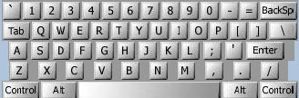
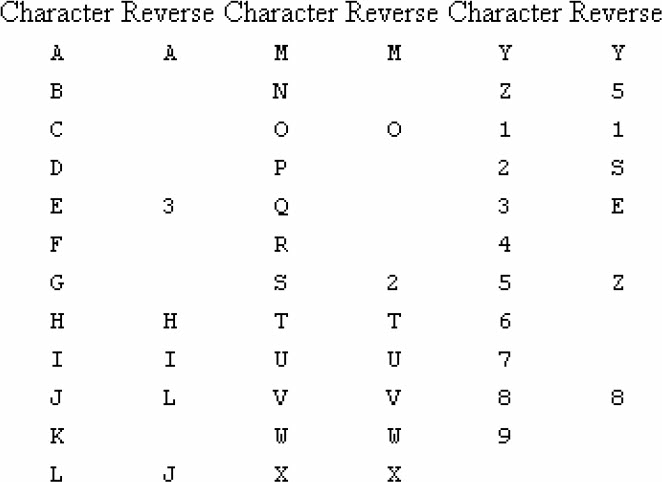
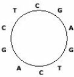

## 开灯问题
有n盏灯，编号为1～n。第1个人把所有灯打开，第2个人按下所有编号为2的倍数的开关（这些灯将被关掉），第3个人按下所有编号为3的倍数的开关（其中关掉的灯将被打开，开着的灯将被关闭），依此类推。一共有k个人，问最后有哪些灯开着？输入n和k，输出开着的灯的编号。k≤n≤1000。

样例输入：
```
7 3
```
样例输出：
```
1 5 6 7
```

## 蛇形填数。
在n×n方阵里填入1，2，…，n×n，要求填成蛇形。例如，n＝4时方阵为：
```
10  11  12  1
9   16  13  2
8   15  14  3
7   6   5   4
```
上面的方阵中，多余的空格只是为了便于观察规律，不必严格输出。n≤8。

## 竖式问题。
找出所有形如abc*de（三位数乘以两位数）的算式，使得在完整的竖式中，所有数字都属于一个特定的数字集合。输入数字集合（相邻数字之间没有空格），输出所有竖式。每个竖式前应有编号，之后应有一个空行。最后输出解的总数。具体格式见样例输出（为了便于观察，竖式中的空格改用小数点显示，但所写程序中应该输出空格，而非小数点）。

样例输入：
```
2357
```
样例输出：
```
<1>
..775
X..33
-----
.2325
2325.
-----
25575
The number of solutions = 1
```

## 例题3-1　TeX中的引号（Tex Quotes, UVa 272）
在TeX中，左双引号是“``”，右双引号是“''”。输入一篇包含双引号的文章，你的任务是把它转换成TeX的格式。

样例输入：
```
"To be or not to be," quoth the Bard, "that
is the question".
```
样例输出：
```
``To be or not to be,'' quoth the Bard, ``that
is the question''.
```

## 例题3-2　WERTYU（WERTYU, UVa10082）
把手放在键盘上时，稍不注意就会往右错一位。这样，输入Q会变成输入W，输入J会变成输入K等。键盘如图3-2所示。

<br>
图3-2　键盘

输入一个错位后敲出的字符串（所有字母均大写），输出打字员本来想打出的句子。输入保证合法，即一定是错位之后的字符串。例如输入中不会出现大写字母A。

样例输入：
```
O S, GOMR YPFSU/
```
样例输出：
```
I AM FINE TODAY.
```

## 例题3-3　回文词（Palindromes, UVa401）
输入一个字符串，判断它是否为回文串以及镜像串。输入字符串保证不含数字0。所谓回文串，就是反转以后和原串相同，如abba和madam。所有镜像串，就是左右镜像之后和原串相同，如2S和3AIAE。注意，并不是每个字符在镜像之后都能得到一个合法字符。在本题中，每个字符的镜像如图3-3所示（空白项表示该字符镜像后不能得到一个合法字符）。

<br>
图3-3　镜像字符

输入的每行包含一个字符串（保证只有上述字符。不含空白字符），判断它是否为回文串和镜像串（共4种组合）。每组数据之后输出一个空行。

样例输入：
```
NOTAPALINDROME
ISAPALINILAPASI
2A3MEAS
ATOYOTA
```
样例输出：
```
NOTAPALINDROME -- is not a palindrome.
ISAPALINILAPASI -- is a regular palindrome.
2A3MEAS -- is a mirrored string.
ATOYOTA -- is a mirrored palindrome.
```

## 例题3-4　猜数字游戏的提示（Master-Mind Hints, UVa 340）
实现一个经典"猜数字"游戏。给定答案序列和用户猜的序列，统计有多少数字位置正确（A），有多少数字在两个序列都出现过但位置不对（B）。

输入包含多组数据。每组输入第一行为序列长度n，第二行是答案序列，接下来是若干猜测序列。猜测序列全0时该组数据结束。n=0时输入结束。

样例输入：
```
4
1 3 5 5
1 1 2 3
4 3 3 5
6 5 5 1
6 1 3 5
1 3 5 5
0 0 0 0
10
1 2 2 2 4 5 6 6 6 9
1 2 3 4 5 6 7 8 9 1
1 1 2 2 3 3 4 4 5 5
1 2 1 3 1 5 1 6 1 9
1 2 2 5 5 5 6 6 6 7
0 0 0 0 0 0 0 0 0 0
0
```
样例输出：
```
Game 1:
    (1,1)
    (2,0)
    (1,2)
    (1,2)
    (4,0)
Game 2:
    (2,4)
    (3,2)
    (5,0)
    (7,0)
```

## 例题3-5　生成元（Digit Generator, ACM/ICPC Seoul 2005, UVa1583）
如果x加上x的各个数字之和得到y，就说x是y的生成元。给出n（1≤n≤100000），求最小生成元。无解输出0。例如，n=216，121，2005时的解分别为198，0，1979。

## 例题3-6　环状序列（Circular Sequence, ACM/ICPC Seoul 2004, UVa1584）

<br>
图3-4　环状串

长度为n的环状串有n种表示法，分别为从某个位置开始顺时针得到。例如，图3-4的环状串有10种表示：CGAGTCAGCT，GAGTCAGCTC，AGTCAGCTCG等。在这些表示法中，字典序最小的称为"最小表示"。

输入一个长度为n（n≤100）的环状DNA串（只包含A、C、G、T这4种字符）的一种表示法，你的任务是输出该环状串的最小表示。例如，CTCC的最小表示是CCCT，CGAGTCAGCT的最小表示为AGCTCGAGTC。

---

* 程序3-1 逆序输出
* 程序3-2 开灯问题
* 程序3-3 蛇形数组
* 程序3-4 竖式问题
* 程序3-5 TeX中的引号
* 程序3-6 WERTYU
* 程序3-7 回文词
* 程序3-8 猜数字游戏的提示
* 程序3-9 生成元
* 程序3-10 环状序列
