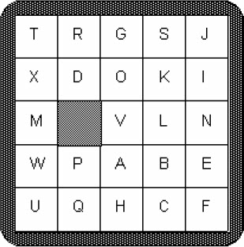
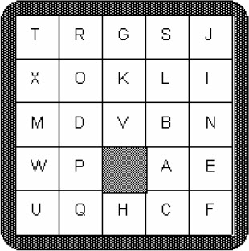
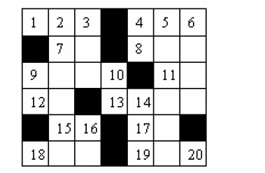
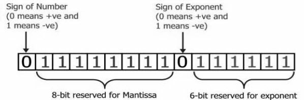

## 习题3-1　得分（Score, ACM/ICPC Seoul 2005, UVa1585）

给出一个由O和X组成的串（长度为1～80），统计得分。每个O的得分为目前连续出现的O的个数，X的得分为0。例如，OOXXOXXOOO的得分为1+2+0+0+1+0+0+1+2+3。

## 习题3-2　分子量（Molar Mass, ACM/ICPC Seoul 2007, UVa1586）

给出一种物质的分子式（不带括号），求分子量。本题中的分子式只包含4种原子，分别为C, H, O, N，原子量分别为12.01, 1.008, 16.00, 14.01（单位：g/mol）。例如，C6H5OH的分子量为94.108g/mol。

## 习题3-3　数数字（Digit Counting , ACM/ICPC Danang 2007, UVa1225）

把前n（n≤10000）个整数顺次写在一起：123456789101112…数一数0～9各出现多少次（输出10个整数，分别是0，1，…，9出现的次数）。

## 习题3-4　周期串（Periodic Strings, UVa455）

如果一个字符串可以由某个长度为k的字符串重复多次得到，则称该串以k为周期。例如，abcabcabcabc以3为周期（注意，它也以6和12为周期）。

输入一个长度不超过80的字符串，输出其最小周期。

【分析】
1. 从小到大验证周期
2. [KMP算法](http://www.ruanyifeng.com/blog/2013/05/Knuth%E2%80%93Morris%E2%80%93Pratt_algorithm.html)

## 习题3-5　谜题（Puzzle, ACM/ICPC World Finals 1993, UVa227）

有一个5*5的网格，其中恰好有一个格子是空的，其他格子各有一个字母。一共有4种指令：A, B, L, R，分别表示把空格上、下、左、右的相邻字母移到空格中。输入初始网格和指令序列（以数字0结束），输出指令执行完毕后的网格。如果有非法指令，应输出“This puzzle has no final configuration.”，例如，图3-5中执行ARRBBL0后，效果如图3-6所示。

<br>
图3-5　执行ARRBBL0前

<br>
图3-6　执行ARRBBL0后

## 习题3-6　纵横字谜的答案（Crossword Answers, ACM/ICPC World Finals 1994, UVa232）

输入一个r行c列（1≤r，c≤10）的网格，黑格用“*”表示，每个白格都填有一个字母。如果一个白格的左边相邻位置或者上边相邻位置没有白格（可能是黑格，也可能出了网格边界），则称这个白格是一个起始格。

首先把所有起始格按照从上到下、从左到右的顺序编号为1, 2, 3,…，如图3-7所示。

<br>
图3-7　r行c列网格

接下来要找出所有横向单词（Across）。这些单词必须从一个起始格开始，向右延伸到一个黑格的左边或者整个网格的最右列。最后找出所有竖向单词（Down）。这些单词必须从一个起始格开始，向下延伸到一个黑格的上边或者整个网格的最下行。输入输出格式和样例请参考原题。

## 习题3-7　DNA序列（DNA Consensus String, ACM/ICPC Seoul 2006, UVa1368）

输入m个长度均为n的DNA序列，求一个DNA序列，到所有序列的总Hamming距离尽量小。两个等长字符串的Hamming距离等于字符不同的位置个数，例如，ACGT和GCGA的Hamming距离为2（左数第1, 4个字符不同）。

输入整数m和n（4≤m≤50, 4≤n≤1000），以及m个长度为n的DNA序列（只包含字母A，C，G，T），输出到m个序列的Hamming距离和最小的DNA序列和对应的距离。如有多解，要求为字典序最小的解。例如，对于下面5个DNA序列，最优解为TAAGATAC。

```
TATGATAC
TAAGCTAC
AAAGATCC
TGAGATAC
TAAGATGT
```

## 习题3-8　循环小数（Repeating Decimals, ACM/ICPC World Finals 1990, UVa202）

输入整数a和b（0≤a≤3000，1≤b≤3000），输出a/b的循环小数表示以及循环节长度。例如a=5，b=43，小数表示为0.(116279069767441860465)，循环节长度为21。

## 习题3-9　子序列（All in All, UVa 10340）

输入两个字符串s和t，判断是否可以从t中删除0个或多个字符（其他字符顺序不变），得到字符串s。例如，abcde可以得到bce，但无法得到dc。

## 习题3-10　盒子（Box, ACM/ICPC NEERC 2004, UVa1587）

给定6个矩形的长和宽wi和hi（1≤wi，hi≤1000），判断它们能否构成长方体的6个面。

## 习题3-11　换低挡装置（Kickdown, ACM/ICPC NEERC 2006, UVa1588）

给出两个长度分别为n1，n2（n1，n2≤100）且每列高度只为1或2的长条。需要将它们放入一个高度为3的容器（如图3-8所示），问能够容纳它们的最短容器长度。

<br>
图3-8　高度为3的容器

## 习题3-12　浮点数（Floating-Point Numbers, UVa11809）

计算机常用阶码-尾数的方法保存浮点数。如图3-9所示，如果阶码有6位，尾数有8位，可以表达的最大浮点数为0.1111111112×21111112。注意小数点后第一位必须为1，所以一共有9位小数。

<br>
图3-9　阶码-尾数保存浮点数

这个数换算成十进制之后就是0.998046875*263=9.205357638345294*1018。你的任务是根据这个最大浮点数，求出阶码的位数E和尾数的位数M。输入格式为AeB，表示最大浮点数为A*10B。0<A<10，并且恰好包含15位有效数字。输入结束标志为0e0。对于每组数据，输出M和E。输入保证有唯一解，且0≤M≤9，1≤E≤30。在本题中，M+E+2不必为8的整数倍。
