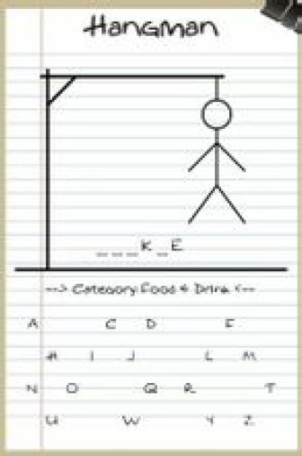
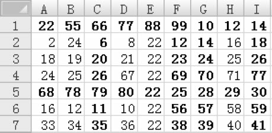
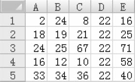
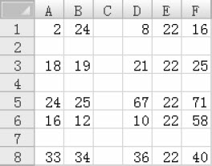

## 计算组合数

编写函数，参数是两个非负整数n和m，返回组合数，其中m≤n≤25。例如，n=25，m=12时答案为5200300。

## 素数判定。

编写函数，参数是一个正整数n，如果它是素数，返回1，否则返回0。

## 例题4-1　古老的密码（Ancient Cipher, NEERC 2004, UVa1339）

给定两个长度相同且不超过100的字符串，判断是否能把其中一个字符串的各个字母重排，然后对26个字母做一个一一映射，使得两个字符串相同。例如，JWPUDJSTVP重排后可以得到WJDUPSJPVT，然后把每个字母映射到它前一个字母（B->A, C->B, …, Z->Y, A->Z），得到VICTORIOUS。输入两个字符串，输出YES或者NO。

## 例题4-2　刽子手游戏（Hangman Judge, UVa 489）

<br>
图4-1　刽子手游戏

刽子手游戏其实是一款猜单词游戏，如图4-1所示。游戏规则是这样的：计算机想一个单词让你猜，你每次可以猜一个字母。如果单词里有那个字母，所有该字母会显示出来；如果没有那个字母，则计算机会在一幅“刽子手”画上填一笔。这幅画一共需要7笔就能完成，因此你最多只能错6次。注意，猜一个已经猜过的字母也算错。

在本题中，你的任务是编写一个“裁判”程序，输入单词和玩家的猜测，判断玩家赢了（You win.）、输了（You lose.）还是放弃了（You chickened out.）。每组数据包含3行，第1行是游戏编号（-1为输入结束标记），第2行是计算机想的单词，第3行是玩家的猜测。后两行保证只含小写字母。

样例输入：
```
1
cheese
chese
2
cheese
abcdefg
3
cheese
abcdefgij
-1
```
样例输出:
```
Round 1
You win.
Round 2
You chickened out.
Round 3
You lose.
```

## 例题4-3　救济金发放（The Dole Queue, UVa 133）

n(n<20)个人站成一圈，逆时针编号为1～n。有两个官员，A从1开始逆时针数，B从n开始顺时针数。在每一轮中，官员A数k个就停下来，官员B数m个就停下来（注意有可能两个官员停在同一个人上）。接下来被官员选中的人（1个或者2个）离开队伍。

输入n，k，m输出每轮里被选中的人的编号（如果有两个人，先输出被A选中的）。例如，n=10，k=4，m=3，输出为4 8, 9 5, 3 1, 2 6, 10, 7。注意：输出的每个数应当恰好占3列。

## 例题4-5　踪电子表格中的单元格（Spreadsheet Tracking, ACM/ICPC World Finals 1997, UVa512）

有一个r行c列（1≤r，c≤50）的电子表格，行从上到下编号为1～r，列从左到右编号为1～c。如图4-2（a）所示，如果先删除第1、5行，然后删除第3, 6, 7, 9列，结果如图4-2（b）所示。

<br>
（a）

<br>
（b）

图4-2　删除行、列

接下来在第2、3、5行前各插入一个空行，然后在第3列前插入一个空列，会得到如图4-3所示结果。

<br>
图4-3　插入行、列

你的任务是模拟这样的n个操作。具体来说一共有5种操作：

* EX r1 c1 r2 c2交换单元格(r1,c1),(r2,c2)。
* &lt;command&gt; A x1 x2 … xA 插入或删除A行或列（DC-删除列，DR-删除行，IC-插入列，IR-插入行，1≤A≤10）。

在插入／删除指令后，各个x值不同，且顺序任意。接下来是q个查询，每个查询格式为“r c”，表示查询原始表格的单元格(r,c)。对于每个查询，输出操作执行完后该单元格的新位置。输入保证在任意时刻行列数均不超过50。

## 例题4-6　师兄帮帮忙（A Typical Homework (a.k.a Shi Xiong Bang Bang Mang), Rujia Liu's Present 5, UVa 12412）

（题目背景略，有兴趣的读者请自行阅读原题）

编写一个成绩管理系统（SPMS）。最多有100个学生，每个学生有如下属性。

* SID：学生编号，包含10位数字。
* CID：班级编号，为不超过20的正整数。
* 姓名：不超过10的字母和数字组成，第一个字符为大写字母。名字中不能有空白字符。
* 4门课程（语文、数学、英语、编程）成绩，均为不超过100的非负整数。

进入SPMS后，应显示主菜单：
```
Welcome to Student Performance Management System (SPMS).
1 - Add
2 - Remove
3 - Query
4 - Show ranking
5 - Show Statistics
0 - Exit
```
选择1之后，会出现添加学生记录的提示信息：
```
Please enter the SID, CID, name and four scores. Enter 0 to finish.
```
然后等待输入。本题保证输入总是合法的（不会有非法的SID、CID，并且恰好有4个分数等），但可能会输入重复SID。在这种情况下，需要输出一行提示：
```
Duplicated SID.
```
不过名字是可以重复的。你的程序应当不停地打印前述提示信息，直到用户输入单个0。然后应当再次打印主菜单。

选择2之后，会出现如下提示信息：
```
Please enter SID or name. Enter 0 to finish.
```
然后等待输入，在数据库中删除能匹配上述SID或者名字的所有学生，并且打印如下信息（xx可以等于0）：
```
xx student(s) removed.
```
你的程序应当不停地打印前述提示信息，直到用户输入单个0，然后再次打印主菜单。

选择3之后，会出现如下提示信息：
```
Please enter SID or name. Enter 0 to finish.
```
然后等待输入。如果数据库中没有能匹配上述SID或者名字的学生，什么都不要做；否则输出所有满足条件的学生，按照进入数据库的顺序排列。输出格式和添加的格式相同，但增加3列：年级排名（第一列）、总分和平均分（最后两列）。所有班级中总分最高的学生获得第1名，如果有两个学生并列第2名，则下一个学生的排名为4（而非3）。你的程序应当不停地打印前述提示信息，直到用户输入单个0。然后应当再次打印主菜单。

选择4之后，会出现如下提示信息：
```
Showing the ranklist hurts students' self-esteem. Don't do that.
```
然后自动返回主菜单。

选择5之后，会出现如下提示信息：
```
Chinese
Average Score: xx.xx
Number of passed students: xx
Number of failed students: xx

…（为了节约篇幅，此处省略了Mathematics、English和Programming的统计信息）

Overall:
Number of students who passed all subjects: xx
Number of students who passed 3 or more subjects: xx
Number of students who passed 2 or more subjects: xx
Number of students who passed 1 or more subjects: xx
Number of students who failed all subjects: xx
```
然后自动回到主菜单。

选择0之后，程序终止。注意，单科成绩和总分都应格式化为整数，但平均分应恰好保留两位小数。

---
* 程序4-1 组合数（有问题）
* 程序4-2 组合数
* 程序4-3 素数判定（有问题）
* 程序4-4 素数判定（2）
* 程序4-5 用函数交换变量（错误）
* 程序4-6 用函数交换变量（正确）
* 程序4-7 计算数组的元素和（错误）
* 程序4-8 计算数组的元素和（正确）
* 程序4-9 计算左闭右开区间内的元素和（两种写法）
* 程序uva1339 古老的密码
* 程序4-10 用递归法计算阶乘
* 程序4-11 刽子手游戏——程序框架
* 程序4-12　刽子手游戏——guess函数
