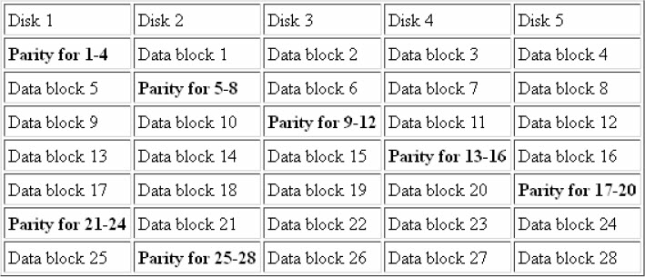
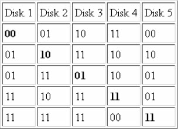
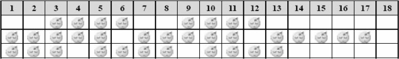

## 习题4-1　象棋（Xiangqi, ACM/ICPC Fuzhou 2011, UVa1589）

考虑一个象棋残局，其中红方有n（2≤n≤7）个棋子，黑方只有一个将。红方除了有一个帅（G）之外还有3种可能的棋子：车（R），马（H），炮（C），并且需要考虑“蹩马腿”（如图4-4所示）与将和帅不能照面（将、帅如果同在一条直线上，中间又不隔着任何棋子的情况下，走子的一方获胜）的规则。
输入所有棋子的位置，保证局面合法并且红方已经将军。你的任务是判断红方是否已经把黑方将死。关于中国象棋的相关规则请参见原题。

 
图4-4　“蹩马腿”情况

## 习题4-2　正方形（Squares, ACM/ICPC World Finals 1990, UVa201）

有n行n列（2≤n≤9）的小黑点，还有m条线段连接其中的一些黑点。统计这些线段连成了多少个正方形（每种边长分别统计）。

行从上到下编号为1～n，列从左到右编号为1～n。边用H i j和V i j表示，分别代表边(i,j)-(i,j+1)和(i,j)-(i+1,j)。如图4-5所示最左边的线段用V 1 1表示。图中包含两个边长为1的正方形和一个边长为2的正方形。

## 习题4-3　黑白棋（Othello, ACM/ICPC World Finals 1992, UVa220）

你的任务是模拟黑白棋游戏的进程。黑白棋的规则为：黑白双方轮流放棋子，每次必须让新放的棋子“夹住”至少一枚对方棋子，然后把所有被新放棋子“夹住”的对方棋子替换成己方棋子。一段连续（横、竖或者斜向）的同色棋子被“夹住”的条件是两端都是对方棋子（不能是空位）。如图4-6（a）所示，白棋有6个合法操作，分别为(2,3),(3,3),(3,5), (6,2),(7,3),(7,4)。选择在(7,3)放白棋后变成如图4-6（b）所示效果（注意有竖向和斜向的共两枚黑棋变白）。注意(4,6)的黑色棋子虽然被夹住，但不是被新放的棋子夹住，因此不变白。

.png) 
(a)

.png) 
(b)

图4-6　黑白棋

输入一个8*8的棋盘以及当前下一次操作的游戏者，处理3种指令：
* L指令打印所有合法操作，按照从上到下，从左到右的顺序排列（没有合法操作时输出No legal move）。
* Mrc指令放一枚棋子在(r,c)。如果当前游戏者没有合法操作，则是先切换游戏者再操作。输入保证这个操作是合法的。输出操作完毕后黑白方的棋子总数。
* Q指令退出游戏，并打印当前棋盘（格式同输入）。

## 习题4-4　骰子涂色（Cube painting, UVa 253）

输入两个骰子，判断二者是否等价。每个骰子用6个字母表示，如图4-7所示。

 
图4-7　骰子涂色

例如rbgggr和rggbgr分别表示如图4-8所示的两个骰子。二者是等价的，因为图4-8（a）所示的骰子沿着竖直轴旋转90°之后就可以得到图4-8（b）所示的骰子。

.png) 
(a)

.png) 
(b)

图4-8　旋转前后的两个骰子

## 习题4-5　IP网络（IP Networks, ACM/ICPC NEERC 2005, UVa1590）

可以用一个网络地址和一个子网掩码描述一个子网（即连续的IP地址范围）。其中子网掩码包含32个二进制位，前32-n位为1，后n位为0，网络地址的前32-n位任意，后n位为0。所有前32-n位和网络地址相同的IP都属于此网络。

例如，网络地址为194.85.160.176（二进制为11000010|01010101|10100000|10110000），子网掩码为255.255.255.248（二进制为11111111|11111111|11111111|11111000），则该子网的IP地址范围是194.85.160.176～194.85.160.183。输入一些IP地址，求最小的网络（即包含IP地址最少的网络），包含所有这些输入地址。

例如，若输入3个IP地址：194.85.160.177、194.85.160.183和194.85.160.178，包含上述3个地址的最小网络的网络地址为194.85.160.176，子网掩码为255.255.255.248。

## 习题4-6　莫尔斯电码（Morse Mismatches, ACM/ICPC World Finals 1997, UVa508）

输入每个字母的Morse编码，一个词典以及若干个编码。对于每个编码，判断它可能是哪个单词。如果有多个单词精确匹配，输出第一个匹配的单词并且后面加上“！”；如果无法精确匹配，可以在编码尾部增加或删除一些字符以后匹配某个单词（增加或删除的字符应尽量少）。如果只能非精确匹配，任选一个可能的匹配单词，后面加上“？”（不管是否多解都要加）。

莫尔斯电码的细节参见原题。

## 习题4-7　RAID技术（RAID!, ACM/ICPC World Finals 1997, UVa509）

RAID技术用多个磁盘保存数据。每份数据在不止一个磁盘上保存，因此在某个磁盘损坏时能通过其他磁盘恢复数据。本题讨论其中一种RAID技术。数据被划分成大小为s（1≤s≤64）比特的数据块保存在d（2≤d≤6）个磁盘上，如图4-9所示，每d-1个数据块都有一个校验块，使得每d个数据块的异或结果为全0（偶校验）或者全1（奇校验）。

 
图4-9　数据保存情况

例如，d=5，s=2，偶校验，数据6C7A79EDFC（二进制01101100 01111010 01111001 11101101 11111100）的保存方式如图4-10所示。

 
图4-10　数据6C7A79EDPC的保存方式

其中加粗块是校验块。输入d、s、b、校验的种类（E表示偶校验，O表示奇校验）以及b（1≤b≤100）个数据块（其中“?”表示损坏的数据），你的任务是恢复并输出完整的数据。如果校验错或者由于损坏数据过多无法恢复，应报告磁盘非法。

提示：本题是位运算的不错练习，但如果没有RAID的知识背景，上述简要翻译可能较难理解，细节建议参考原题。

## 习题4-8　特别困的学生（Extraordinarily Tired Students, ACM/ICPC Xi'an 2006, UVa12108）

课堂上有n个学生（n≤10）。每个学生都有一个“睡眠-清醒”周期，其中第i个学生醒Ai分钟后睡Bi分钟，然后重复（1≤Ai，Bi≤5），初始时第i个学生处在他的周期的第Ci分钟。每个学生在临睡前会察看全班睡觉人数是否严格大于清醒人数，只有这个条件满足时才睡觉，否则就坚持听课Ai分钟后再次检查这个条件。问经过多长时间后全班都清醒。如果用(A,B,C)描述一些学生，则图4-11中描述了3个学生(2,4,1)、(1,5,2)和(1,4,3)在每个时刻的行为。

 
图4-11　3个学生每个时刻的行为

注意：有可能并不存在“全部都清醒”的时刻，此时应输出-1。

## 习题4-9　数据挖掘（Data Mining, ACM/ICPC NEERC 2003, UVa1591）

有两个n元素数组P和Q。P数组每个元素占SP个字节，Q数组每个元素占SQ个字节。有时需直接根据P数组中某个元素P(i)的偏移量Pofs(i)算出对应的Q(i)的偏移量Qofs(i)。当两个数组的元素均为连续存储时Qofs(i)=Pofs(i)/SP*SQ，但因为除法慢，可以把式子改写成速度较快的Qofs'(i)=(Pofs(i)+Pofs(i)<<A)>>B。为了让这个式子成立，在P数组仍然连续存储的前提下，Q数组可以不连续存储（但不同数组元素的存储空间不能重叠）。这样做虽然会浪费一些空间，但是提升了速度，是一种用空间换时间的方法。

输入n、SP和SQ（N≤220，1≤SP，SQ≤210），你的任务是找到最优的A和B，使得占的空间K尽量小。输出K、A、B的值。多解时让A尽量小，如果仍多解则让B尽量小。

提示：本题有一定实际意义，不过描述比较抽象。如果对本题兴趣不大，可以先跳过。

## 习题4-10　洪水！（Flooded! ACM/ICPC World Finals 1999, UVa815）

有一个n*m（1≤m，n<30）的网格，每个格子是边长10米的正方形，网格四周是无限大的墙壁。输入每个格子的海拔高度，以及网格内雨水的总体积，输出水位的海拔高度以及有多少百分比的区域有水（即高度严格小于水平面）。

本题有多种方法，能锻炼思维，建议读者一试。
