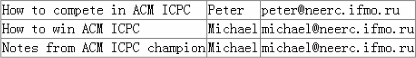
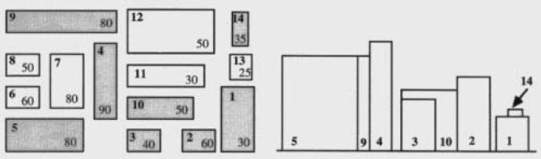

## 例题5-1　大理石在哪儿（Where is the Marble？，Uva 10474）

现有N个大理石，每个大理石上写了一个非负整数。首先把各数从小到大排序，然后回答Q个问题。每个问题问是否有一个大理石写着某个整数x，如果是，还要回答哪个大理石上写着x。排序后的大理石从左到右编号为1～N。（在样例中，为了节约篇幅，所有大理石上的数合并到一行，所有问题也合并到一行。）

样例输入：
```
4 1
2 3 5 1
5
5 2
1 3 3 3 1
2 3
0 0
```
样例输出：
```
CASE #1:
5 found at 4
CASE #2:
2 not found
3 found at 3
```

## 例题5-2　木块问题（The Blocks Problem，Uva 101）

从左到右有n个木块，编号为0～n-1，要求模拟以下4种操作（下面的a和b都是木块编号）。
* move a onto b：把a和b上方的木块全部归位，然后把a摞在b上面。
* move a over b：把a上方的木块全部归位，然后把a放在b所在木块堆的顶部。
* pile a onto b：把b上方的木块全部归位，然后把a及上面的木块整体摞在b上面。
* pile a over b：把a及上面的木块整体摞在b所在木块堆的顶部。
遇到quit时终止一组数据。a和b在同一堆的指令是非法指令，应当忽略。

样例输入：
```
10
move 9 onto 1
move 8 over 1
move 7 over 1
move 6 over 1
pile 8 over 6
pile 8 over 5
move 2 over 1
move 4 over 9
quit
```
样例输出：
```
0: 0
1: 1 9 2 4
2:
3: 3
4:
5: 5 8 7 6
6:
7:
8:
9:
```

## 例题5-3　安迪的第一个字典（Andy's First Dictionary，Uva 10815）

输入一个文本，找出所有不同的单词（连续的字母序列），按字典序从小到大输出。单词不区分大小写。

样例输入：
```
Adventures in Disneyland
Two blondes were going to Disneyland when they came to a fork in the road. The sign read: "Disneyland Left."
So they went home.
```
样例输出（为了节约篇幅只保留前5行）：
```
a
adventures
blondes
came
disneyland
```

## 例题5-4　反片语（Ananagrams，Uva 156）

输入一些单词，找出所有满足如下条件的单词：该单词不能通过字母重排，得到输入文本中的另外一个单词。在判断是否满足条件时，字母不分大小写，但在输出时应保留输入中的大小写，按字典序进行排列（所有大写字母在所有小写字母的前面）。

样例输入：
```
ladder came tape soon leader acme RIDE lone Dreis peat
ScAlE orb eye Rides dealer NotE derail LaCeS drIed
noel dire Disk mace Rob dries
#
```
样例输出：
```
Disk
NotE
derail
drIed
eye
```

## 例题5-5　集合栈计算机（The Set Stack Computer，ACM/ICPC NWERC 2006，UVa12096）

有一个专门为了集合运算而设计的“集合栈”计算机。该机器有一个初始为空的栈，并且支持以下操作。

* PUSH：空集“{}”入栈。
* DUP：把当前栈顶元素复制一份后再入栈。
* UNION：出栈两个集合，然后把二者的并集入栈。
* INTERSECT：出栈两个集合，然后把二者的交集入栈。
* ADD：出栈两个集合，然后把先出栈的集合加入到后出栈的集合中，把结果入栈。

每次操作后，输出栈顶集合的大小（即元素个数）。例如，栈顶元素是A={{}，{{}}}，下一个元素是B={{}，{{{}}}}，则：

* UNION操作将得到{{}，{{}}，{{{}}}}，输出3。
* INTERSECT操作将得到{{}}，输出1。
* ADD操作将得到{{}，{{{}}}，{{}，{{}}}}，输出3。

输入不超过2000个操作，并且保证操作均能顺利进行（不需要对空栈执行出栈操作）。

## 例题5-6　团体队列（Team Queue，UVa540）

有t个团队的人正在排一个长队。每次新来一个人时，如果他有队友在排队，那么这个新人会插队到最后一个队友的身后。如果没有任何一个队友排队，则他会排到长队的队尾。

输入每个团队中所有队员的编号，要求支持如下3种指令（前两种指令可以穿插进行）。

* ENQUEUEx：编号为x的人进入长队。
* DEQUEUE：长队的队首出队。
* STOP：停止模拟。

对于每个DEQUEUE指令，输出出队的人的编号。

## 例题5-7　丑数（Ugly Numbers，Uva 136）

丑数是指不能被2，3，5以外的其他素数整除的数。把丑数从小到大排列起来，结果如下：

1,2,3,4,5,6,8,9,10,12,15,...

求第1500个丑数。

## 例题5-8　Unixls命令（Unix ls，UVa400）

输入正整数n以及n个文件名，排序后按列优先的方式左对齐输出。假设最长文件名有M字符，则最右列有M字符，其他列都是M＋2字符。

样例输入（略，可以由样例输出推出）

样例输出：
```
------------------------------------------------------------
Alice       Chris       Jan         Marsha      Ruben
Bobby       Cindy       Jody        Mike        Shirley
Buffy       Danny       Keith       Mr._French  Sissy
Carol       Greg        Lori        Peter
```

## 例题5-9　数据库（Database，ACM/ICPC NEERC 2009，UVa1592）

输入一个n行m列的数据库（1≤n≤10000，1≤i≤10），是否存在两个不同行r1，r2和两个不同列c1，c2，使得这两行和这两列相同（即（r1，c1）和（r2，c1）相同，（r1，c2）和（r2，c2）相同）。例如，对于如图5-3所示的数据库，第2、3行和第2、3列满足要求。

<br>
图5-3　数据库

## 例题5-10　PGA巡回赛的奖金（PGA Tour Prize Money，ACM/ICPC World Finals 1990，UVa207）

你的任务是为PGA（美国职业高尔夫球协会）巡回赛计算奖金。巡回赛分为4轮，其中所有选手都能打前两轮（除非中途取消资格），得分相加（越少越好），前70名（包括并列）晋级（make the cut）。所有晋级选手再打两轮，前70名（包括并列）有奖金。组委会事先会公布每个名次能拿的奖金比例。例如，若冠军比例是18％，总奖金是$1000000，则冠军奖金是$180000。

输入保证冠军不会并列。如果第k名有n人并列，则第k～n＋k-1名的奖金比例相加后平均分给这n个人。奖金四舍五入到美分。所有业余选手不得奖金。例如，若业余选手得了第3名，则第4名会拿第3名的奖金比例。如果没取消资格的非业余选手小于70名，则剩下的奖金就不发了。

输入第一行为数据组数。每组数据前有一个空行，然后分为两部分。第一部分有71行（各有一个实数），第一行为总奖金，第i＋1行为第i名的奖金比例。比例均保留4位小数，且总和为100％。第72行为选手数（最多144），然后每行一个选手，格式为：

Player name RD1 RD2 RD3 RD4

业余选手名字后会有一个“*”。犯规选手在犯规的那一轮成绩为DQ，并且后面不再有其他成绩。但是只要没犯规，即使没有晋级，也会给出4轮成绩（虽然在实际比赛中没晋级的选手只会有两个成绩）。输入保证至少有70个人晋级。

输入举例：
```
140
WALLY WEDGE            70 70 70 70
SANDY LIE              80 DQ
SID SHANKER*           90 99 62 61
...
JIMMY ABLE             69 73 80 DQ
```
输出应包含所有晋级到后半段（make the cut）的选手。输出信息包括：选手名字、排名、各轮得分、总得分以及奖金数。没有得奖则不输出，若有奖金，即使奖金是$0.00也要输出，保留两位小数）。如果此名次至少有两个人获得奖金，应在名次后面加“T”。犯规选手列在最后，总得分为DQ，名次为空。如果有并列，则先按轮数排序，然后按各轮得分之和排序，最后按名字排序。两组数据的输出之间用一个空格隔开。

输出举例：
```
Player Name         Place   RDJ   RD2   RD3   RD4   TOTAL   Money Won
-----------------------------------------------------------------------
WALLY WEDGE         1       70    70    70    70    280     $ 180000.00
HENRY HACKER        2T      77    70    70    70    287     $  88000.00
TOMMY TWO IRON      2T      71    72    72    72    287     $  88000.00
BEN BIRDIE          4       70    74    72    72    288     $  48000.00
NORMAN NIBLICK*     4       72    72    72    72    288
...
LEE THREE WINES     71      99    99    99    98    395     $   2000.00
JOHNY MELAVO        72      99    99    99    99    396
JIMMY ABLE          69      73    80    DQ
EDDIE EAGLE         71      71    DQ
```

## 例题5-11　邮件传输代理的交互（The Letter Carrier's Rounds, ACM/ICPC World Finals 1999, UVa814）

本题的任务为模拟发送邮件时MTA（邮件传输代理）之间的交互。所谓MTA，就是email地址格式user@mtaname的“后面部分”。当某人从user1@mta1发送给另一个人user2@mta2时，这两个MTA将会通信。如果两个收件人属于同一个MTA，发送者的MTA只需与这个MTA通信一次就可以把邮件发送给这两个人。

输入每个MTA里的用户列表，对于每个发送请求（输入发送者和接收者列表），按顺序输出所有MTA之间的SMTP（简单邮件协议）交互。协议细节参见原题。

发送人MTA连接收件人MTA的顺序应该与在输入中第一次出现的顺序一致。例如，若发件人是Hamdy@Cairo，收件人列表为Conrado@MexicoCity、Shariff@SanFrancisco、Lisa@MexicoCity，则Cairo应当依次连接MexicoCity和SanFrancisco。

如果连接某个MTA之后发现所有收件人都不存在，则不应该发送DATA。所有用户名均由不超过15个字母和数字组成。

## 例题5-12　城市正视图（Urban Elevations, ACM/ICPC World Finals 1992, UVa221）

如图5-4所示，有n（n≤100）个建筑物。左侧是俯视图（左上角为建筑物编号，右下角为高度），右侧是从南向北看的正视图。

<br>
图5-4　建筑俯视图与正视图

输入每个建筑物左下角坐标（即x、y坐标的最小值）、宽度（即x方向的长度）、深度（即y方向的长度）和高度（以上数据均为实数），输出正视图中能看到的所有建筑物，按照左下角x坐标从小到大进行排序。左下角x坐标相同时，按y坐标从小到大排序。

输入保证不同的x坐标不会很接近（即任意两个x坐标要么完全相同，要么差别足够大，不会引起精度问题）。

---
* 程序5-1 C++版的“a+b程序”
* 程序5-2 C++版最小值
* 程序5-3 C++使用引用交换变量
* 程序5-4 C++字符串流
* 程序5-5 C++结构体
* 程序5-6 C++模板方法
* 程序5-7 C++模板结构体
* 程序5-8 C++STL优先队列
* 程序5-9 测试STL
* 程序5-10 大整数类BigInteger