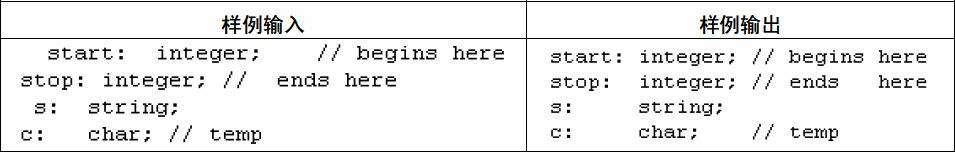

## 习题5-1　代码对齐（Alignment of Code, ACM/ICPCNEERC 2010, UVa1593）

输入若干行代码，要求各列单词的左边界对齐且尽量靠左。单词之间至少要空一格。每个单词不超过80个字符，每行不超过180个字符，一共最多1000行，样例输入与输出如图5-5所示。

 
图5-5　对齐代码的样例输入与输出

## 习题5-2　Ducci序列（Ducci Sequence, ACM/ICPC Seoul 2009, UVa1594）

对于一个n元组(a1, a2, …, an)，可以对于每个数求出它和下一个数的差的绝对值，得到一个新的n元组(|a1-a2|, |a2-a3|, …, |an-a1|)。重复这个过程，得到的序列称为Ducci序列，例如：

(8, 11, 2, 7) -> (3, 9, 5, 1) -> (6, 4, 4, 2) -> (2, 0, 2, 4) -> (2, 2, 2, 2) -> (0, 0, 0, 0).

也有的Ducci序列最终会循环。输入n元组（3≤n≤15），你的任务是判断它最终会变成0还是会循环。输入保证最多1000步就会变成0或者循环。

## 习题5-3　卡片游戏（Throwing cards away I, UVa 10935）

桌上有n（n≤50）张牌，从第一张牌（即位于顶面的牌）开始，从上往下依次编号为1～n。当至少还剩下两张牌时进行以下操作：把第一张牌扔掉，然后把新的第一张牌放到整叠牌的最后。输入每行包含一个n，输出每次扔掉的牌以及最后剩下的牌。

## 习题5-4　交换学生（Foreign Exchange, UVa 10763）

有n（1≤n≤500000）个学生想交换到其他学校学习。为了简单起见，规定每个想从A学校换到B学校的学生必须找一个想从B换到A的“搭档”。如果每个人都能找到搭档（一个人不能当多个人的搭档），学校就会同意他们交换。每个学生用两个整数A、B表示，你的任务是判断交换是否可以进行。

## 习题5-5　复合词（Compound Words, UVa 10391）

给出一个词典，找出所有的复合词，即恰好有两个单词连接而成的单词。输入每行都是一个由小写字母组成的单词。输入已按照字典序从小到大排序，且不超过120000个单词。输出所有复合词，按照字典序从小到大排列。

## 习题5-6　对称轴（Symmetry, ACM/ICPC Seoul 2004, UVa1595）

给出平面上N（N≤1000）个点，问是否可以找到一条竖线，使得所有点左右对称。例如图5-6中，左边的图形有对称轴，右边没有。

## 习题5-7　打印队列（Printer Queue, ACM/ICPC NWERC 2006, UVa12100）

学生会里只有一台打印机，但是有很多文件需要打印，因此打印任务不可避免地需要等待。有些打印任务比较急，有些不那么急，所以每个任务都有一个1～9间的优先级，优先级越高表示任务越急。

打印机的运作方式如下：首先从打印队列里取出一个任务J，如果队列里有比J更急的任务，则直接把J放到打印队列尾部，否则打印任务J（此时不会把它放回打印队列）。

输入打印队列中各个任务的优先级以及所关注的任务在队列中的位置（队首位置为0），输出该任务完成的时刻。所有任务都需要1分钟打印。例如，打印队列为{1, 1, 9, 1, 1, 1}，目前处于队首的任务最终完成时刻为5。

## 习题5-8　图书管理系统（Borrowers, ACM/ICPC World Finals 1994, UVa230）

你的任务是模拟一个图书管理系统。首先输入若干图书的标题和作者（标题各不相同，以END结束），然后是若干指令：BORROW指令表示借书，RETURN指令表示还书，SHELVE指令表示把所有已归还但还未上架的图书排序后依次插入书架并输出图书标题和插入位置（可能是第一本书或者某本书的后面）。

图书排序的方法是先按作者从小到大排，再按标题从小到大排。在处理第一条指令之前，你应当先将所有图书按照这种方式排序。

## 习题5-9　找bug（Bug Hunt, ACM/ICPC Tokyo 2007, UVa1596）

输入并模拟执行一段程序，输出第一个bug所在的行。每行程序有两种可能：

* 数组定义，格式为arr[size]。例如a[10]或者b[5]，可用下标分别是0～9和0～4。定义之后所有元素均为未初始化状态。
* 赋值语句，格式为arr[index]=value。例如a[0]=3或者a[a[0]]=a[1]。
赋值语句可能会出现两种bug：下标index越界；使用未初始化的变量（index和value都可能出现这种情况）。

程序不超过1000行，每行不超过80个字符且所有常数均为小于231的非负整数。

## 习题5-10　在Web中搜索（Searching the Web, ACM/ICPCBeijing 2004, UVa1597）

输入n篇文章和m个请求（n<100，m≤50000），每个请求都是以下4种格式之一。

* A：查找包含关键字A的文章。
* A AND B：查找同时包含关键字A和B的文章。
* A OR B：查找包含关键字A或B的文章。
* NOT A：查找不包含关键字A的文章。
处理询问时，需要对于每篇文章输出证据。前3种询问输出所有至少包含一个关键字的行，第4种询问输出整篇文章。关键字只由小写字母组成，查找时忽略大小写。每行不超过80个字符，一共不超过1500行。

本题有一定实际意义，并且能锻炼编码能力，建议读者一试。

## 习题5-11　更新字典（Updating a Dictionary, UVa12504）

在本题中，字典是若干键值对，其中键为小写字母组成的字符串，值为没有前导零或正号的非负整数（-4，03和+77都是非法的，注意该整数可以很大）。输入一个旧字典和一个新字典，计算二者的变化。输入的两个字典中键都是唯一的，但是排列顺序任意。具体格式为（注意字典格式中不含任何空白字符）：

{key:value,key:value,…,key:value}

输入包含两行，各包含不超过100个字符，即旧字典和新字典。输出格式如下：

* 如果至少有一个新增键，打印一个“+”号，然后是所有新增键，按字典序从小到大排列。
* 如果至少有一个删除键，打印一个“-”号，然后是所有删除键，按字典序从小到大排列。
* 如果至少有一个修改键，打印一个“*”号，然后是所有修改键，按字典序从小到大排列。
* 如果没有任何修改，输出No changes。
例如，若输入两行分别为{a:3,b:4,c:10,f:6}和{a:3,c:5,d:10,ee:4}，输出为以下3行：+d,ee；-b,f；*c。

## 习题5-12　地图查询（Do You Know The Way to San Jose?,ACM/ICPC World Finals 1997, UVa511）

有n张地图（已知名称和某两个对角线端点的坐标）和m个地名（已知名称和坐标），还有q个查询。每张地图都是边平行于坐标轴的矩形，比例定义为高度除以宽度的值。每个查询包含一个地名和详细等级i。面积相同的地图总是属于同一个详细等级。假定包含此地名的地图中一共有k种不同的面积，则合法的详细等级为1～k（其中1最不详细，k最详细，面积越小越详细）。如果详细等级i的地图不止一张，则输出地图中心和查询地名最接近的一张；如果还有并列的，地图长宽比应尽量接近0.75（这是Web浏览器的比例）；如果还有并列，查询地名和地图右下角的坐标应最远（对应最少的滚动条移动）；如果还有并列，则输出x坐标最小的一个。如果查询的地名不存在或者没有地图包含它，或者包含它的地图总数超过i，应报告查询非法（并输出包含它的最详细地图名称，如果存在）。

提示：本题的要求比较细致，如果打算编程实现，建议参考原题。

## 习题5-13　客户中心模拟（Queue and A, ACM/ICPC World Finals 2000, UVa822）

你的任务是模拟一个客户中心运作情况。客服请求一共有n（1≤n≤20）种主题，每种主题用5个整数描述：tid, num, t0, t, dt，其中tid为主题的唯一标识符，num为该主题的请求个数，t0为第一个请求的时刻，t为处理一个请求的时间，dt为相邻两个请求之间的间隔（为了简单情况，假定同一个主题的请求按照相同的间隔到达）。

客户中心有m（1≤m≤5）个客服，每个客服用至少3个整数描述：pid, k, tid1, tid2, …, tidk，表示一个标识符为pid的人可以处理k种主题的请求，按照优先级从大到小依次为tid1, tid2, …, tidk。当一个人有空时，他会按照优先级顺序找到第一个可以处理的请求。如果有多个人同时选中了某个请求，上次开始处理请求的时间早的人优先；如果有并列，id小的优先。输出最后一个请求处理完毕的时刻。

## 习题5-14　交易所（Exchange, ACM/ICPC NEERC 2006, UVa1598）

你的任务是为交易所设计一个订单处理系统。要求支持以下3种指令。

* BUY p q：有人想买，数量为p，价格为q。
* SELL p q：有人想卖，数量为p，价格为q。
* CANCEL i：取消第i条指令对应的订单（输入保证该指令是BUY或者SELL）。
交易规则如下：对于当前买订单，若当前最低卖价（ask price）低于当前出价，则发生交易；对于当前卖订单，若当前最高买价（bid price）高于当前价格，则发生交易。发生交易时，按供需物品个数的最小值交易。交易后，需修改订单的供需物品个数。当出价或价格相同时，按订单产生的先后顺序发生交易。输入输出细节请参考原题。

提示：本题是一个不错的优先队列练习题。

## 习题5-15　Fibonacci的复仇（Revenge of Fibonacci, ACM/ICPC Shanghai 2011, UVa12333）

Fibonacci数的定义为：F(0)=F(1)=1，然后从F(2)开始，F(i)=F(i-1)+F(i-2)。例如，前10项Fibonacci数分别为1, 1, 2, 3, 5, 8, 13, 21, 34, 55……

有一天晚上，你梦到了Fibonacci，它告诉你一个有趣的Fibonacci数。醒来以后，你只记得了它的开头几个数字。你的任务是找出以它开头的最小Fibonacci数的序号。例如以12开头的最小Fibonacci数是F(25)。输入不超过40个数字，输出满足条件的序号。

如果序号小于100000的Fibonacci数均不满足条件，输出-1。

提示：本题有一定效率要求。如果高精度代码比较慢，可能会超时。

## 习题5-16　医院设备利用（Use of Hospital Facilities, ACM/ICPC World Finals 1991, UVa212）

医院里有n（n≤10）个手术室和m（m≤30）个恢复室。每个病人首先会被分配到一个手术室，手术后会被分配到一个恢复室。从任意手术室到任意恢复室的时间均为t1，准备一个手术室和恢复室的时间分别为t2和t3（一开始所有手术室和恢复室均准备好，只有接待完一个病人之后才需要为下一个病人准备）。

k名（k≤100）病人按照花名册顺序排队，T点钟准时开放手术室。每当有准备好的手术室时，队首病人进入其中编号最小的手术室。手术结束后，病人应立刻进入编号最小的恢复室。如果有多个病人同时结束手术，在编号较小的手术室做手术的病人优先进入编号较小的恢复室。输入保证病人无须排队等待恢复室。

输入n、m、T、t1、t2、t3、k和k名病人的名字、手术时间和恢复时间，模拟这个过程。输入输出细节请参考原题。

提示：虽然是个模拟题，但是最好先理清思路，减少不必要的麻烦。本题是一个很好的编程练习，但难度也不小。
