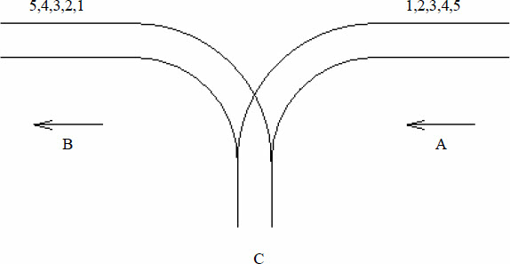

## 例题6-1　并行程序模拟（Concurrency Simulator, ACM/ICPC World Finals 1991, UVa210）

你的任务是模拟n个程序（按输入顺序编号为1～n）的并行执行。每个程序包含不超过25条语句，格式一共有5种：var = constant（赋值）；print var（打印）；lock；unlock；end。

变量用单个小写字母表示，初始为0，为所有程序公有（因此在一个程序里对某个变量赋值可能会影响另一个程序）。常数是小于100的非负整数。
 
每个时刻只能有一个程序处于运行态，其他程序均处于等待态。上述5种语句分别需要t1、t2、t3、t4、t5单位时间。运行态的程序每次最多运行Q个单位时间（称为配额）。当一个程序的配额用完之后，把当前语句（如果存在）执行完之后该程序会被插入一个等待队列中，然后处理器从队首取出一个程序继续执行。初始等待队列包含按输入顺序排列的各个程序，但由于lock/unlock语句的出现，这个顺序可能会改变。

lock的作用是申请对所有变量的独占访问。lock和unlock总是成对出现，并且不会嵌套。lock总是在unlock的前面。当一个程序成功执行完lock指令之后，其他程序一旦试图执行lock指令，就会马上被放到一个所谓的阻止队列的尾部（没有用完的配额就浪费了）。当unlock执行完毕后，阻止队列的第一个程序进入等待队列的首部。

输入n, t1, t2, t3, t4, t5, Q以及n个程序，按照时间顺序输出所有print语句的程序编号和结果。

## 例题6-2　铁轨（Rails, ACM/ICPC CERC 1997, UVa 514）

某城市有一个火车站，铁轨铺设如图6-1所示。有n节车厢从A方向驶入车站，按进站顺序编号为1～n。你的任务是判断是否能让它们按照某种特定的顺序进入B方向的铁轨并驶出车站。例如，出栈顺序(5 4 1 2 3)是不可能的，但(5 4 3 2 1)是可能的。

<br>
图6-1　铁轨

为了重组车厢，你可以借助中转站C。这是一个可以停放任意多节车厢的车站，但由于末端封顶，驶入C的车厢必须按照相反的顺序驶出C。对于每个车厢，一旦从A移入C，就不能再回到A了；一旦从C移入B，就不能回到C了。换句话说，在任意时刻，只有两种选择：A→C和C→B。

## 例题6-3　矩阵链乘（Matrix Chain Multiplication, UVa 442）

输入n个矩阵的维度和一些矩阵链乘表达式，输出乘法的次数。如果乘法无法进行，输出error。假定A是m*n矩阵，B是n*p矩阵，那么AB是m*p矩阵，乘法次数为m*n*p。如果A的列数不等于B的行数，则乘法无法进行。

例如，A是50*10的，B是10*20的，C是20*5的，则(A(BC))的乘法次数为10*20*5（BC的乘法次数）+ 50*10*5（(A(BC))的乘法次数）= 3500。

## 例题6-4　破损的键盘（又名：悲剧文本）（Broken Keyboard（a.k.a. Beiju Text）, UVa 11988）

你有一个破损的键盘。键盘上的所有键都可以正常工作，但有时Home键或者End键会自动按下。你并不知道键盘存在这一问题，而是专心地打稿子，甚至连显示器都没打开。当你打开显示器之后，展现在你面前的是一段悲剧的文本。你的任务是在打开显示器之前计算出这段悲剧文本。

输入包含多组数据。每组数据占一行，包含不超过100000个字母、下划线、字符“[”或者“]”。其中字符“[”表示Home键，“]”表示End键。输入结束标志为文件结束符（EOF）。输入文件不超过5MB。对于每组数据，输出一行，即屏幕上的悲剧文本。

样例输入：
```
This_is_a_[Beiju]_text
[[]][][]Happy_Birthday_to_Tsinghua_University
```
样例输出：
```
BeijuThis_is_a__text
Happy_Birthday_to_Tsinghua_University
```

## 例题6-5　移动盒子（Boxes in a Line, UVa 12657）

你有一行盒子，从左到右依次编号为1, 2, 3,…, n。可以执行以下4种指令：

* 1 X Y表示把盒子X移动到盒子Y左边（如果X已经在Y的左边则忽略此指令）。
* 2 X Y表示把盒子X移动到盒子Y右边（如果X已经在Y的右边则忽略此指令）。
* 3 X Y表示交换盒子X和Y的位置。
* 4 表示反转整条链。
指令保证合法，即X不等于Y。例如，当n=6时在初始状态下执行114后，盒子序列为2 3 1 4 5 6。接下来执行2 3 5，盒子序列变成2 1 4 5 3 6。再执行3 1 6，得到2 6 4 5 3 1。最终执行4，得到1 3 5 4 6 2。

输入包含不超过10组数据，每组数据第一行为盒子个数n和指令条数m（1≤n,m≤100000），以下m行每行包含一条指令。每组数据输出一行，即所有奇数位置的盒子编号之和。位置从左到右编号为1～n。

样例输入：
```
6 4
1 1 4
2 3 5
3 1 6
4
6 3
1 1 4
2 3 5
3 1 6
100000 1
4
```
样例输出：
```
Case 1: 12
Case 2: 9
Case 3: 2500050000
```

## 例题6-6　小球下落（Dropping Balls, UVa 679）

有一棵二叉树，最大深度为D，且所有叶子的深度都相同。所有结点从上到下从左到右编号为1, 2, 3,…, 2D-1。在结点1处放一个小球，它会往下落。每个内结点上都有一个开关，初始全部关闭，当每次有小球落到一个开关上时，状态都会改变。当小球到达一个内结点时，如果该结点上的开关关闭，则往左走，否则往右走，直到走到叶子结点，如图6-2所示。

<br>
图6-2　所有叶子深度相同的二叉树

一些小球从结点1处依次开始下落，最后一个小球将会落到哪里呢？输入叶子深度D和小球个数I，输出第I个小球最后所在的叶子编号。假设I不超过整棵树的叶子个数。D≤20。输入最多包含1000组数据。

样例输入：
```
4 2
3 4
10 1
2 2
8 128
16 12345
```
样例输出：
```
12
7
512
3
255
36358
```

## 例题6-7　树的层次遍历（Trees on the level, Duke 1993, UVa 122）

输入一棵二叉树，你的任务是按从上到下、从左到右的顺序输出各个结点的值。每个结点都按照从根结点到它的移动序列给出（L表示左，R表示右）。在输入中，每个结点的左括号和右括号之间没有空格，相邻结点之间用一个空格隔开。每棵树的输入用一对空括号“()”结束（这对括号本身不代表一个结点），如图6-3所示。

<br>
图6-3　一棵二叉树

注意，如果从根到某个叶结点的路径上有的结点没有在输入中给出，或者给出超过一次，应当输出-1。结点个数不超过256。

样例输入：
```
(11,LL) (7,LLL) (8,R) (5,) (4,L) (13,RL) (2,LLR) (1,RRR) (4,RR) ()
(3,L) (4,R) ()
```
样例输出：
```
5 4 8 11 13 4 7 2 1
-1
```

## 例题6-8　树（Tree, UVa 548）

给一棵点带权（权值各不相同，都是小于10000的正整数）的二叉树的中序和后序遍历，找一个叶子使得它到根的路径上的权和最小。如果有多解，该叶子本身的权应尽量小。输入中每两行表示一棵树，其中第一行为中序遍历，第二行为后序遍历。

样例输入：
```
3 2 1 4 5 7 6
3 1 2 5 6 7 4
7 8 11 3 5 16 12 18
8 3 11 7 16 18 12 5
255
255
```
样例输出：
```
1
3
255
```

## 例题6-9　天平（Not so Mobile, UVa 839）

输入一个树状天平，根据力矩相等原则判断是否平衡。如图6-5所示，所谓力矩相等，就是WlDl=WrDr，其中Wl和Wr分别为左右两边砝码的重量，D为距离。

采用递归（先序）方式输入：每个天平的格式为Wl，Dl，Wr，Dr，当Wl或Wr为0时，表示该“砝码”实际是一个子天平，接下来会描述这个子天平。当Wl=Wr=0时，会先描述左子天平，然后是右子天平。

样例输入：
```
1
0 2 0 4
0 3 0 1
1 1 1 1
2 4 4 2
1 6 3 2
```
其正确输出为YES，对应图6-6。

<br>
图6-5　天平

<br>
图6-6　正确输出

## 例题6-10　下落的树叶（The Falling Leaves, UVa 699）


图6-7　结点权值

给一棵二叉树，每个结点都有一个水平位置：左子结点在它左边1个单位，右子结点在右边1个单位。从左向右输出每个水平位置的所有结点的权值之和。如图6-7所示，从左到右的3个位置的权和分别为7，11，3。按照递归（先序）方式输入，用-1表示空树。

样例输入：
```
5 7 -1 6 -1 -1 3 -1 -1
8 2 9 -1 -1 6 5 -1 -1 12 -1 -1 3 7 -1 -1 -1
-1
```
样例输出：
```
Case 1:
7 11 3

Case 2:
9 7 21 15
```

## 例题6-11　四分树（Quadtrees, UVa 297）

如图6-8所示，可以用四分树来表示一个黑白图像，方法是用根结点表示整幅图像，然后把行列各分成两等分，按照图中的方式编号，从左到右对应4个子结点。如果某子结点对应的区域全黑或者全白，则直接用一个黑结点或者白结点表示；如果既有黑又有白，则用一个灰结点表示，并且为这个区域递归建树。

<br>
图6-8　四分树

给出两棵四分树的先序遍历，求二者合并之后（黑色部分合并）黑色像素的个数。p表示中间结点，f表示黑色（full），e表示白色（empty）。

样例输入：
```
3
ppeeefpffeefe
pefepeefe
peeef
peefe
peeef
peepefefe
```
样例输出：
```
There are 640 black pixels.
There are 512 black pixels.
There are 384 black pixels.
```

## 例题6-12　油田（Oil Deposits, UVa 572）

输入一个m行n列的字符矩阵，统计字符“@”组成多少个八连块。如果两个字符“@”所在的格子相邻（横、竖或者对角线方向），就说它们属于同一个八连块。例如，图6-9中有两个八连块。

<br>
图6-9　八连块

## 例题6-13　古代象形符号（Ancient Messages, World Finals 2011, UVa 1103）

本题的目的是识别3000年前古埃及用到的6种象形文字，如图6-10所示。

<br>
图6-10　古代象形符号

每组数据包含一个H行W列的字符矩阵（H≤200，W≤50），每个字符为4个相邻像素点的十六进制（例如，10011100对应的字符就是9c）。转化为二进制后1表示黑点，0表示白点。输入满足：

* 不会出现上述6种符号之外的其他符号。
* 输入至少包含一个符号，且每个黑像素都属于一个符号。
* 每个符号都是一个四连块，并且不同符号不会相互接触，也不会相互包含。
* 如果两个黑像素有公共顶点，则它们一定有一个相同的相邻黑像素（有公共边）。
* 符号的形状一定和表6-9中的图形拓扑等价（可以随意拉伸但不能拉断）。

要求按照字典序输出所有符号。例如，图6-11中的输出应为AKW。

<br>
图6-11　输出AKW

## 例题6-14　Abbott的复仇（Abbott's Revenge, ACM/ICPC World Finals 2000, UVa 816）

有一个最多包含9*9个交叉点的迷宫。输入起点、离开起点时的朝向和终点，求一条最短路（多解时任意输出一个即可）。

<br>
图6-14　迷宫及走向

这个迷宫的特殊之处在于：进入一个交叉点的方向（用NEWS这4个字母分别表示北东西南，即上右左下）不同，允许出去的方向也不同。例如，1 2 WLF NR ER *表示交叉点(1,2)（上数第1行，左数第2列）有3个路标（字符“*”只是结束标志），如果进入该交叉点时的朝向为W（即朝左），则可以左转（L）或者直行（F）；如果进入时朝向为N或者E则只能右转（R），如图6-14所示。

注意：初始状态是“刚刚离开入口”，所以即使出口和入口重合，最短路也不为空。例如，图6-14中的一条最短路为(3,1) (2,1) (1,1) (1,2) (2,2) (2,3) (1,3) (1,2) (1,1) (2,1) (2,2) (1,2) (1,3) (2,3) (3,3)。

## 例题6-15　给任务排序（Ordering Tasks, UVa 10305）

假设有n个变量，还有m个二元组(u, v)，分别表示变量u小于v。那么，所有变量从小到大排列起来应该是什么样子的呢？例如，有4个变量a, b, c, d，若已知a < b，c < b，d < c，则这4个变量的排序可能是a < d < c < b。尽管还有其他可能（如d < a < c < b），你只需找出其中一个即可。

## 例题6-16　单词（Play On Words, UVa 10129）

输入n（n≤100000）个单词，是否可以把所有这些单词排成一个序列，使得每个单词的第一个字母和上一个单词的最后一个字母相同（例如acm、malform、mouse）。每个单词最多包含1000个小写字母。输入中可以有重复单词。

## 例题6-17　看图写树（Undraw the Trees, UVa 10562）

你的任务是将多叉树转化为括号表示法。如图6-16所示，每个结点用除了“-”、“|”和空格的其他字符表示，每个非叶结点的正下方总会有一个“|”字符，然后下方是一排“-”字符，恰好覆盖所有子结点的上方。单独的一行“#”为数据结束标记。

<br>
图6-16　样例输入与输出

## 例题6-18　雕塑（Sculpture, ACM/ICPC NWERC 2008, UVa12171）

某雕塑由n（n≤50）个边平行于坐标轴的长方体组成。每个长方体用6个整数x0，y0，z0，x，y，z表示（均为1～500的整数），其中x0为长方体的顶点中x坐标的最小值，x表示长方体在x方向的总长度。其他4个值类似定义。你的任务是统计这个雕像的体积和表面积。注意，雕塑内部可能会有密闭的空间，其体积应计算在总体积中，但从“外部”看不见的面不应计入表面积。雕塑可能会由多

## 例题6-19　自组合（Self-Assembly, ACM/ICPC World Finals 2013, UVa 1572）

有n（n≤40000）种边上带标号的正方形。每条边上的标号要么为一个大写字母后面跟着一个加号或减号，要么为数字00。当且仅当两条边的字母相同且符号相反时，两条边能拼在一起（00不能和任何边拼在一起，包括另一条标号为00的边）。

假设输入的每种正方形都有无穷多种，而且可以旋转和翻转，你的任务是判断能否组成一个无限大的结构。每条边要么悬空（不和任何边相邻），要么和一个上述可拼接的边相邻。如图6-17（a）所示是3个正方形，图6-17（b）所示边是它们组成的一个合法结构（但大小有限）。

.png)<br>
（a）

.png)<br>
（b）

图6-17　自组合正方形


## 例题6-20　理想路径（Ideal Path, NEERC 2010, UVa1599）

给一个n个点m条边（2≤n≤100000，1≤m≤200000）的无向图，每条边上都涂有一种颜色。求从结点1到结点n的一条路径，使得经过的边数尽量少，在此前提下，经过边的颜色序列的字典序最小。一对结点间可能有多条边，一条边可能连接两个相同结点。输入保证结点1可以达到结点n。颜色为1～10<sup>9</sup>的整数。

## 例题6-21　系统依赖（System Dependencies, ACM/ICPC World Finals 1997, UVa506）

软件组件之间可能会有依赖关系，例如，TELNET和FTP都依赖于TCP/IP。你的任务是模拟安装和卸载软件组件的过程。首先是一些DEPEND指令，说明软件之间的依赖关系（保证不存在循环依赖），然后是一些INSTALL、REMOVE和LIST指令，如表6-1所示。

表6-1　指令说明

| 指令 | 说明 |
| - | - |
| DEPEND item1 item2 [item3 …] | item1依赖组件item2, item3, … |
| INSTALL item1 | 安装item1和它的依赖（已安装过的不用重新安装） |
| REMOVE item1 | 卸载item1和它的依赖（如果某组件还被其他显式安装的组件所依赖，则不能卸载这个组件） |
| LIST | 输出所有已安装组件 |

在INSTALL指令中提到的组件称为显式安装，这些组件必须用REMOVE指令显式删除。同样地，被这些显式安装组件所直接或间接依赖的其他组件也不能在REMOVE指令中删除。

每行指令包含不超过80个字符，所有组件名称都是大小写敏感的。指令名称均为大写字母。

## 例题6-22　战场（Paintball, UVa 11853）

有一个1000×1000的正方形战场，战场西南角的坐标为(0,0)，西北角的坐标为(0,1000)。战场上有n（0≤n≤1000）个敌人，第i个敌人的坐标为(xi,yi)，攻击范围为ri。为了避开敌人的攻击，在任意时刻，你与每个敌人的距离都必须严格大于它的攻击范围。你的任务是从战场的西边（x=0的某个点）进入，东边（x=1000的某个点）离开。如果有多个位置可以进/出，你应当求出最靠北的位置。输入每个敌人的xi、yi、ri，输出进入战场和离开战场的坐标。

