## 习题6-1　平衡的括号（Parentheses Balance, UVa 673）

输入一个包含“( )”和“[ ]”的括号序列，判断是否合法。具体规则如下：

* 空串合法。
* 如果A和B都合法，则AB合法。
* 如果A合法则(A)和[A]都合法。

## 习题6-2　S树（S-Trees, UVa 712）

给出一棵满二叉树，每一层代表一个01变量，取0时往左走，取1时往右走。例如，图6-19（a）和图6-19（b）都对应表达式x1∧(x2∨x3)。

.png)<br>
（a）

.png)<br>
（b）

图6-19　S树

给出所有叶子的值以及一些查询（即每个变量xi的取值），求每个查询到达的叶子的值。例如，有4个查询：000、010、111、110，则输出应为0011。

## 习题6-3　二叉树重建（Tree Recovery, ULM 1997, UVa 536）

输入一棵二叉树的先序遍历和中序遍历序列，输出后序遍历序列，如图6-20所示。

| 样例输入 | 样例输出 |
| - | - |
| DBACEGF ABCDEFG | ACBFGED |
| BCAD CBAD | CDAB |

图6-20　二叉树重建

## 习题6-4　骑士的移动（Knight Moves, UVa 439）

输入标准8*8国际象棋棋盘上的两个格子（列用a～h表示，行用1～8表示），求马最少需要多少步从起点跳到终点。例如从a1到b2需要4步。马的移动方式如图6-21所示。

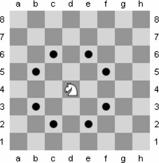<br>
图6-21　马的移动方式

## 习题6-5　巡逻机器人（Patrol Robot, ACM/ICPC Hanoi 2006, UVa1600）

机器人要从一个m*n（1≤m，n≤20）网格的左上角(1,1)走到右下角(m,n)。网格中的一些格子是空地（用0表示），其他格子是障碍（用1表示）。机器人每次可以往4个方向走一格，但不能连续地穿越k（0≤k≤20）个障碍，求最短路长度。起点和终点保证是空地。例如，对于图6-22（a）中的数据，图6-22（b）中显示的是最优解，路径长度为10。

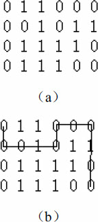<br>
图6-22　最短路径示例

## 习题6-6　修改天平（Equilibrium Mobile, NWERC 2008, UVa12166）

给一个深度不超过16的二叉树，代表一个天平。每根杆都悬挂在中间，每个秤砣的重量已知。至少修改多少个秤砣的重量才能让天平平衡？如图6-23所示，把7改成3即可。

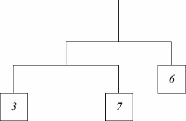<br>
图6-23　修改天平

## 习题6-7　Petri网模拟（Petri Net Simulation, ACM/ICPC World Finals 1998, UVa804）

你的任务是模拟Petri网的变迁。Petri网包含NP个库所（用P1，P2…表示）和NT个变迁（用T1，T2…表示）。0<NP, NT<100。当每个变迁的每个输入库所都至少有一个token时，变迁是允许的。变迁发生的结果是每个输入库所减少一个token，每个输出库所增加一个token。变迁的发生是原子性的，即所有token的增加和减少应同时进行。注意，一个变迁可能有多个相同的输入或者输出。如果一个库所在变迁的输入库所列表中出现了两次，则token会减少两个。输出库所也是类似。如果有多个变迁是允许的，一次只能发生一个。

如图6-24所示，一开始只有T1是允许的，发生一次T1变迁之后有一个token会从P1移动到P2，但仍然只有T1是允许的，因为T2要求P2有两个token。再发生一次T1变迁之后P1中只剩一个token，而P2中有两个，因为T1和T2都可以发生。假定T2发生，则P2中不再有token，而P3中有一个token，因此T1和T3都是允许的。

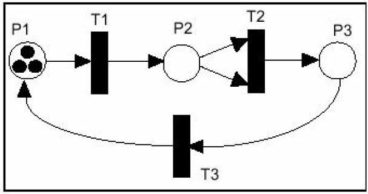<br>
图6-24　Petri网模拟

输入一个Petri网络。初始时每个库所都有一个token。每个变迁用一个整数序列表示，负数表示输入库所，正数表示输出库所。每个变迁至少包含一个输入和一个输出。最后输入一个整数NF，表示要发生NF次变迁（同时有多个变迁允许时可以任选一个发生，输入保证这个选择不会影响最终结果）。

本题有一定实际意义，理解题意后编码并不复杂，建议读者一试。

## 习题6-8　空间结构（Spatial Structures, ACM/ICPC World Finals 1998, UVa806）

黑白图像有两种表示法：点阵表示和路径表示。路径表示法首先需要把图像转化为四分树，然后记录所有黑结点到根的路径。例如，对于如图6-25所示的图像。

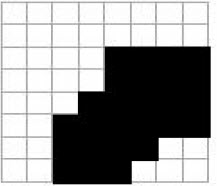
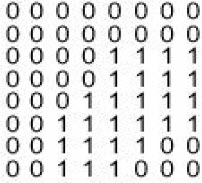
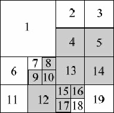<br>
图6-25　黑白图像

四分树如图6-26所示。

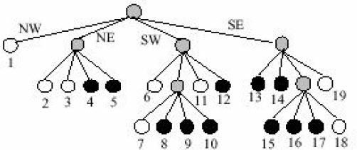<br>
图6-26　黑白图像四分树

NW、NE、SW、SE分别用1、2、3、4表示。最后把得到的数字串看成是五进制的，转化为十进制后排序。例如上面的树在转化、排序后的结果是：9 14 17 22 23 44 63 69 88 94 113。

你的任务是在这两种表示法之间进行转换。在点阵表示法中，1表示黑色，0表示白色。图像总是正方形的，且长度n为2的整数幂，并满足n≤64。输入输出细节请参见原题。

本题有一定实际意义，而且需要注意细节，建议读者一试。

## 习题6-9　纸牌游戏（“Accordian” Patience, UVa 127）

把52张牌从左到右排好，每张牌自成一个牌堆（pile）。当某张牌与它左边那张牌或者左边第3张牌“match”（花色suit或者点数rank相同）时，就把这张牌移到那张牌上面。移动之后还要查看是否可以进行其他移动。只有位于牌堆顶部的牌才能移动或者参与match。当牌堆之间出现空隙时要立刻把右边的所有牌堆左移一格来填补空隙。如果有多张牌可以移动，先移动最左边的那张牌；如果既可以移一格也可以移3格时，移3格。按顺序输入52张牌，输出最后的牌堆数以及各牌堆的牌数。

样例输入：
```
QD AD 8H 5S 3H 5H TC 4D JH KS 6H 8S JS AC AS 8D 2H QS TS 3S AH 4H TH TD 3C 6S
8C 7D 4C 4S 7S 9H 7C 5D 2S KD 2D QH JD 6D 9D JC 2C KH 3D QC 6C 9S KC 7H 9C 5C
AC 2C 3C 4C 5C 6C 7C 8C 9C TC JC QC KC AD 2D 3D 4D 5D 6D 7D 8D TD 9D JD QD KD
AH 2H 3H 4H 5H 6H 7H 8H 9H KH 6S QH TH AS 2S 3S 4S 5S JH 7S 8S 9S TS JS QS KS
#
```
样例输出：
```
6 piles remaining: 40 8 1 1 1 1
1 pile remaining: 52
```

## 习题6-10　10-20-30游戏（10-20-30, ACM/ICPC World Finals 1996, UVa246）

有一种纸牌游戏叫做10-20-30。游戏使用除大王和小王之外的52张牌，J、Q、K的面值是10，A的面值是1，其他牌的面值等于它的点数。

把52张牌叠放在一起放在手里，然后从最上面开始依次拿出7张牌从左到右摆成一条直线放在桌子上，每一张牌代表一个牌堆。每次取出手中最上面的一张牌，从左至右依次放在各个牌堆的最下面。当往最右边的牌堆放了一张牌以后，重新往最左边的牌堆上放牌。

如果当某张牌放在某个牌堆上后，牌堆的最上面两张和最下面一张牌的和等于10、20或者30，这3张牌将会从牌堆中拿走，然后按顺序放回手中并压在最下面。如果没有出现这种情况，将会检查最上面一张和最下面两张牌的和是否为10、20或者30，解决方法类似。如果仍然没有出现这种情况，最后检查最下面的3张牌的和，并用类似的方法处理。例如，如果某一牌堆中的牌从上到下依次是5、9、7、3，那么放上6以后的布局如图6-27所示。

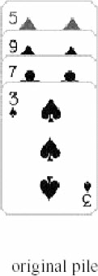
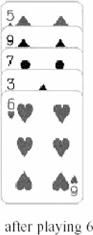
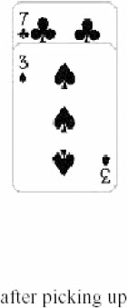<br>		
图6-27　放上6后布局

如果放的不是6，而是Q，对应的情况如图6-28所示。

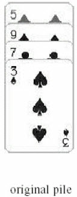
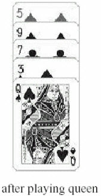
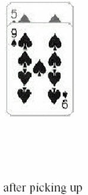<br>		
图6-28　放上Q后布局

如果某次操作后某牌堆中没有剩下一张牌，那么将该牌堆便永远地清除掉，并把它右边的所有牌堆顺次往左移。如果所有牌堆都清除了，游戏胜利结束；如果手里没有牌了，游戏以失败告终；有时游戏永远无法结束，这时则称游戏出现循环。给出52张牌最开始在手中的顺序，请模拟这个游戏并计算出游戏结果。

## 习题6-11　树重建（Tree Reconstruction, UVa 10410）

输入一个n（n≤1000）结点树的BFS序列和DFS序列，你的任务是输出每个结点的子结点列表。输入序列（不管是BFS还是DFS）是这样生成的：当一个结点被扩展时，其所有子结点应该按照编号从小到大的顺序访问。

例如，若BFS序列为4 3 5 1 2 8 7 6，DFS序列为4 3 1 7 2 6 5 8，则一棵满足条件的树如图6-29所示。

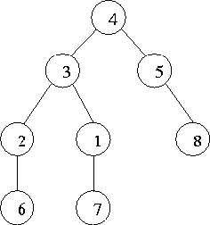<br>
图6-29　树重建

## 习题6-12　筛子难题（A Dicey Problem, ACM/ICPC World Finals 1999, UVa810）

图6-30（a）是一个迷宫，图6-30（b）是一个筛子。你的任务是把筛子放在起点（筛子顶面和正面的数字由输入给定），经过若干次滚动以后回到起点。

每次到达一个新格子时，格子上的数字必须和与它接触的筛子上的数字相同，除非到达的格子上画着五星（此时，与它接触的筛子上的数字可以任意）。输入一个R和C行（1≤R，C≤10）的迷宫、起点坐标以及顶面、正面的数字，输出一条可行的路径。

.png)<br>
（a）	
.png)<br>
（b）

图6-30　筛子难题

## 习题6-13　电子表格计算器（Spreadsheet Calculator,ACM/ICPC World Finals 1992, UVa215）

在一个R行C列（R≤20，C≤10）的电子表格中，行编号为A～T，列编号为0～9。按照行优先顺序输入电子表格的各个单元格。每个单元格可能是整数（可能是负数）或者引用了其他单元格的表达式（只包含非负整数、单元格名称和加减号，没有括号）。表达式保证以单元格名称开头，内部不含空白字符，且最多包含75个字符。

尽量计算出所有表达式的值，然后输出各个单元格的值（计算结果保证为绝对值不超过10000的整数）。如果某些单元格循环引用，在表格之后输出（仍按行优先顺序），如图6-31所示。

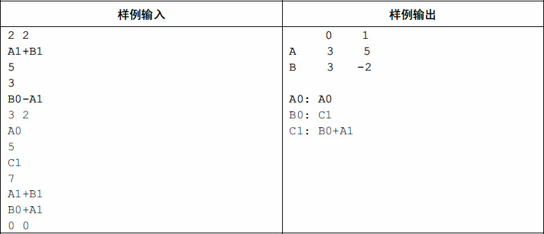<br>
图6-31　电子表格计算器输入与输出

## 习题6-14　检查员的难题（Inspector's Dilemma, ACM/ICPC Dhaka 2007, UVa12118）

某国家有V（V≤1000）个城市，每两个城市之间都有一条双向道路直接相连，长度为T。你的任务是找一条最短的道路（起点和终点任意），使得该道路经过E条指定的边。

例如，若V=5，E=3，T=1，指定的3条边为1-2、1-3和4-5，则最优道路为3-1-2-4-5，长度为4*1=4。
