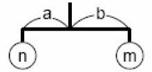
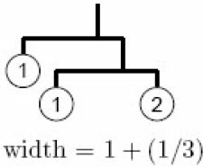
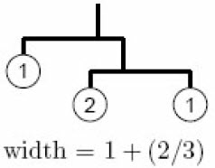
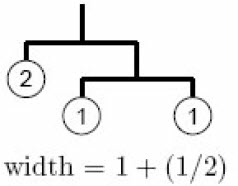
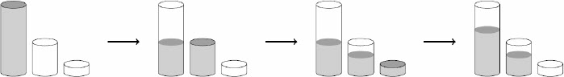
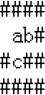
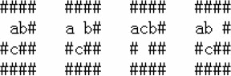

## 例题7-1 除法（Division, UVa 725） 

输入正整数n，按从小到大的顺序输出所有形如abcde/fghij = n的表达式，其中a～j恰好为数字0～9的一个排列（可以有前导0），2≤n≤79。 
样例输入： 
```
62
```
样例输出：
```
79546 / 01283 = 62 
94736 / 01528 = 62
```

## 例题7-2 最大乘积（Maximum Product, UVa 11059） 

输入n个元素组成的序列S，你需要找出一个乘积最大的连续子序列。如果这个最大的乘积不是正数，应输出0（表示无解）。1≤n≤18，-10≤Si≤10。 
样例输入： 
```
3
2 4 -3
5
2 5 -1 2 -1
```
样例输出：
```
8
20
```

## 例题7-3 分数拆分（Fractions Again?!, UVa 10976） 

输入正整数k，找到所有的正整数x≥y，使得1/k = 1/x + 1/y。

样例输入：
```
2
12
```
样例输出：
```
2
1/2 = 1/6 + 1/3
1/2 = 1/4 + 1/4
8
1/12 = 1/156 + 1/13
1/12 = 1/84 + 1/14
1/12 = 1/60 + 1/15
1/12 = 1/48 + 1/16
1/12 = 1/36 + 1/18
1/12 = 1/30 + 1/20
1/12 = 1/28 + 1/21
1/12 = 1/24 + 1/24
```

## 例题7-4 素数环（Prime Ring Problem, UVa 524） 

输入正整数n，把整数1, 2, 3,…, n组成一个环，使得相邻两个整数之和均为素数。输出时从整数1开始逆时针排列。同一个环应恰好输出一次。n≤16。 

样例输入： 
```
6
```
样例输出：
```
1 4 3 2 5 6
1 6 5 2 3 4
```

## 例题7-5 困难的串（Krypton Factor, UVa 129） 

如果一个字符串包含两个相邻的重复子串，则称它是“容易的串”，其他串称为“困难的串”。例如，BB、ABCDACABCAB、ABCDABCD都是容易的串，而D、DC、ABDAB、CBABCBA都是困难的串。 输入正整数n和L，输出由前L个字符组成的、字典序第k小的困难的串。例如，当L=3时，前7个困难的串分别为A、AB、ABA、ABAC、ABACA、ABACAB、ABACABA。输入保证答案不超过80个字符。 

样例输入： 
```
7 3
30 3
```
样例输出：
```
ABAC ABA
7
ABAC ABCA CBAB CABA CABC ACBA CABA
28
```

## 例题7-6　带宽（Bandwidth, UVa 140）

给出一个n（n≤8）个结点的图G和一个结点的排列，定义结点i的带宽b(i)为i和相邻结点在排列中的最远距离，而所有b(i)的最大值就是整个图的带宽。给定图G，求出让带宽最小的结点排列，如图7-7所示。

<br>
图7-7　图G

下面两个排列的带宽分别为6和5。具体来说，图7-8（a）中各个结点的带宽分别为6, 6, 1, 4, 1, 1, 6, 6，图7-8（b）中各个结点的带宽分别为5, 3, 1, 4, 3, 5, 1, 4。

.png)<br>
(a)

.png)<br>
(b)

图7-8　两个排列的带宽

## 例题7-7　天平难题（Mobile Computing, ACM/ICPC Tokyo 2005, UVa1354）

给出房间的宽度r和s个挂坠的重量wi。设计一个尽量宽（但宽度不能超过房间宽度r）的天平，挂着所有挂坠。

天平由一些长度为1的木棍组成。木棍的每一端要么挂一个挂坠，要么挂另外一个木棍。如图7-9所示，设n和m分别是两端挂的总重量，要让天平平衡，必须满足n*a=m*b。

<br>
图7-9　天平

例如，如果有3个重量分别为1, 1, 2的挂坠，有3种平衡的天平，如图7-10所示。



<br>
图7-10　3种平衡的天平

挂坠的宽度忽略不计，且不同的子天平可以相互重叠。如图7-11所示，宽度为(1/3)+1+(1/4)。

输入第一行为数据组数。每组数据前两行为房间宽度r和挂坠数目s（0<r<10，1≤s≤6）。以下s行每行为一个挂坠的重量Wi（1≤wi≤1000）。输入保证不存在天平的宽度恰好在r-10-5和r+10-5之间（这样可以保证不会出现精度问题）。对于每组数据，输出最优天平的宽度。如果无解，输出-1。你的输出和标准答案的绝对误差不应超过10-8。

## 例题7-8　倒水问题（Fill, UVa 10603）

有装满水的6升的杯子、空的3升杯子和1升杯子，3个杯子中都没有刻度。在不使用其他道具的情况下，是否可以量出4升的水呢？

方法如图7-15所示。

<br>
图7-15　倒水问题：一种方法是(6,0,0)→(3,3,0)→(3,2,1)→(4,2,0)

注意：由于没有刻度，用杯子x给杯子y倒水时必须一直持续到把杯子y倒满或者把杯子x倒空，而不能中途停止。

你的任务是解决一般性的问题：设3个杯子的容量分别为a, b, c，最初只有第3个杯子装满了c升水，其他两个杯子为空。最少需要倒多少升水才能让某一个杯子中的水有d升呢？如果无法做到恰好d升，就让某一个杯子里的水是d'升，其中d'<d并且尽量接近d。（1≤a,b,c,d≤200）。要求输出最少的倒水量和目标水量（d或者d'）。

## 例题7-9　万圣节后的早晨（The Morning after Halloween, Japan 2007, UVa1601）

w*h（w,h≤16）网格上有n（n≤3）个小写字母（代表鬼）。要求把它们分别移动到对应的大写字母里。每步可以有多个鬼同时移动（均为往上下左右4个方向之一移动），但每步结束之后任何两个鬼不能占用同一个位置，也不能在一步之内交换位置。例如如图7-17所示的局面：一共有4种移动方式，如图7-18所示。

<br>
图7-17　题设局面

<br>
图7-18　4种移动方式

输入保证所有空格连通，所有障碍格也连通，且任何一个2*2子网格中至少有一个障碍格。输出最少的步数。输入保证有解。
